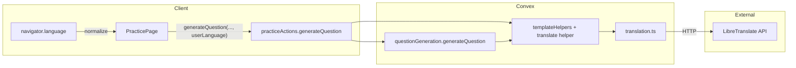

# Auto Translation implementation plan

## Goal

- **New helper**: `{{translate someText}}` in Question Type templates.
- **Direction**: From the Question Type language (e.g. French) **into** the user's language (e.g. English from the browser).
- **Source of "user language"**: `navigator.language` from the browser. A user profile with a preferred language may be introduced later and could then override this.
- **Backend**: Self-contained translation layer with a clear interface; use LibreTranslate via the [translate](https://www.npmjs.com/package/translate) npm package; configure via environment variables.

---

## Architecture

- **Client**: Sends `userLanguage` (derived from browser) along with existing `questionTypeId` and `language` when calling the generate-question action.
- **Action**: Validates optional `userLanguage`, builds a `translate` helper that calls the translation module with `from = language` (question type) and `to = userLanguage`, merges it into template helpers, and runs question generation.
- **Translation module**: Single public interface `translateText(text, from, to)` and a factory that uses env for URL/key; no Handlebars dependency.

---

## 1. Translation module (self-contained)

**New file**: [convex/translation.ts](convex/translation.ts)

- **Interface**:  
`translateText(text: string, fromLang: string, toLang: string): Promise<string>`
- **Implementation**:
  - Use the `translate` npm package (add dependency).
  - Use the `Translate` constructor (not the default export) so configuration is per-instance and testable:  
  `Translate({ engine: "libre", url, key })` with `url` and `key` from a small config.
  - Config: read `process.env.LIBRETRANSLATE_URL` (optional; default e.g. `"https://libretranslate.com"`) and `process.env.LIBRETRANSLATE_API_KEY` (optional for public/self-hosted).
  - Export a **factory** that returns the translate function, e.g.  
  `createTranslator(config?: { url?: string; apiKey?: string }) => (text, from, to) => Promise<string>`  
  so production uses env and tests can inject a mock or a test endpoint.
- **Behavior**: If `fromLang === toLang` or text is empty, return text without calling the API. On API errors, throw or return a clear error so the helper can behave predictably (see below).
- **Convex**: This code will run inside a Convex action (`"use node"`). Use `process.env` for URL and API key; set these in the Convex dashboard (or `npx convex env set`).

**Docs**: Add a short note in [docs/features/Auto Translation.md](docs/features/Auto Translation.md) under Technical Notes: env vars `LIBRETRANSLATE_URL`, `LIBRETRANSLATE_API_KEY`; self-contained module in `convex/translation.ts`.

---

## 2. Translate Handlebars helper

**Location**: Either a new small file (e.g. `convex/translateHelper.ts`) or alongside [convex/templateHelpers.ts](convex/templateHelpers.ts).

- **Signature**: Helper usable as `{{translate someText}}` (one positional argument: the text to translate).
- **Creation**:  
`createTranslateHelper(fromLang: string, toLang: string, translateFn: (text: string, from: string, to: string) => Promise<string>): Handlebars.HelperDelegate`
- **Behavior**:
  - Resolve `someText` (may be a Promise from another helper); if empty or not a string, return empty string.
  - If `fromLang === toLang`, return the text unchanged.
  - Otherwise call `translateFn(text, fromLang, toLang)` and return the result.
  - On failure: either rethrow (so question generation fails) or return the original text and log; the plan assumes **rethrow** so template authors see a clear error. Optional: later add a hash option to fallback to original text.
- **Async**: Helper must return a Promise (Handlebars async helpers are already used in [convex/questionGeneration.ts](convex/questionGeneration.ts)).

---

## 3. Wire into question generation and action

- **[convex/questionGeneration.ts](convex/questionGeneration.ts)**  
  - Extend `GenerateQuestionParams` with optional `userLanguage?: string`.  
  - Do **not** create the translate helper inside `questionGeneration`; keep that module agnostic of translation. The translate helper is passed in via `templateHelpers` like `noun`/`verb`.
- **[convex/practiceActions.ts](convex/practiceActions.ts)**  
  - Add optional arg `userLanguage: v.optional(v.string())`.  
  - If `userLanguage` is present and non-empty:  
    - Create translator with `createTranslator({ url: process.env.LIBRETRANSLATE_URL, apiKey: process.env.LIBRETRANSLATE_API_KEY })`.  
    - Create translate helper with `createTranslateHelper(args.language, args.userLanguage, translator)`.  
    - Merge into helpers: `templateHelpers = { ...getTemplateHelpersForLanguage(args.language).templateHelpers, translate: translateHelper }`.
  - If `userLanguage` is absent: do not register `translate`; templates that use `{{translate ...}}` will break at runtime (or we could register a no-op that returns the first argument; the plan prefers **not** registering so misuse is obvious).

---

## 4. Client: pass user language from the browser

- **[src/routes/PracticePage.tsx](src/routes/PracticePage.tsx)**  
  - When calling `generateQuestion`, pass `userLanguage` derived from `**navigator.language`**.  
  - Normalize to a 2-letter code (e.g. `"en-US"` → `"en"`) so it matches LibreTranslate’s expected codes.  
  - Reuse or define a small helper (e.g. in [src/lib/languages.ts](src/lib/languages.ts)) so normalization is consistent and we don’t send arbitrary long locale strings.  
  - If the user has no browser language (e.g. SSR), fallback to a safe default (e.g. `"en"`) so the action still receives a string when we want translate enabled.  
  - *(Later: a user profile with preferred language could override `navigator.language` here.)*

---

## 5. Dependencies and env

- **npm**: Add dependency `translate` (e.g. `^3.0.1`).  
- **Convex env** (document in README or env example and in [docs/features/Auto Translation.md](docs/features/Auto Translation.md)):  
  - `LIBRETRANSLATE_URL` (optional): default `https://libretranslate.com`.  
  - `LIBRETRANSLATE_API_KEY` (optional): for public LibreTranslate or self-hosted instances that require a key.

---

## 6. Tests

- **Unit tests for translation module** ([convex/translation.test.ts](convex/translation.test.ts)):  
  - With a mock or stub: fromLang/toLang/text → expected call and return value.  
  - When `from === to` or text is empty, no HTTP call and return same text.
- **Translate helper**: Test in [convex/templateHelpers.test.ts](convex/templateHelpers.test.ts) (not in `questionGeneration.test.ts`, which is already large). Add tests that call `generateQuestion` with a stub `translateFn` (e.g. returning `"translated"`) registered via `createTranslateHelper`, and assert that templates using `{{translate "hello"}}` render to the stubbed value. Reuse the same pattern as existing noun/verb tests in that file.
- **practiceActions.generateQuestion**: In [convex/practice.test.ts](convex/practice.test.ts), existing tests need not pass `userLanguage` (optional). Add one test that passes `userLanguage`, uses a question type with `{{translate "something"}}` in the template, and mocks or stubs the translation layer so the action succeeds and the result contains the translated string (or mock at the HTTP level if feasible in Convex test env).

---

## 7. Documentation

- Update [docs/features/Auto Translation.md](docs/features/Auto Translation.md): implementation summary, env vars, and that the helper is only registered when `userLanguage` is provided.  
- If the data model or public API changes, update [docs/DATA_MODEL.md](docs/DATA_MODEL.md) / [docs/ARCHITECTURE.md](docs/ARCHITECTURE.md) as per project rules.

---

## Clarification

- **User language source**: Use `**navigator.language`** as the “user’s language” for translation (target language). The client passes it to the action as `userLanguage`; the translate helper uses it as `toLang`.  
- **Future**: A user profile with a preferred language could later replace or override `navigator.language` when calling the action; the rest of the implementation stays the same.

---

## Summary of files

| File                                                  | Change                                                                                     |
| ----------------------------------------------------- | ------------------------------------------------------------------------------------------ |
| `convex/translation.ts`                               | **New**: translate interface + factory using `translate` package and env.                  |
| `convex/translation.test.ts`                          | **New**: unit tests for translation module.                                                |
| `convex/translateHelper.ts` (or `templateHelpers.ts`) | **New** or extend: `createTranslateHelper(fromLang, toLang, translateFn)`.                 |
| `convex/questionGeneration.ts`                        | Optional `userLanguage` in params (only if we pass it for logging; otherwise action-only). |
| `convex/practiceActions.ts`                           | Optional `userLanguage` arg; create and register translate helper when present.            |
| `src/routes/PracticePage.tsx`                         | Derive `userLanguage` from browser and pass to `generateQuestion`.                         |
| `src/lib/languages.ts`                                | Optional: add `getBrowserLanguageCode()` or similar for normalization.                     |
| `package.json`                                        | Add `translate` dependency.                                                                |
| `docs/features/Auto Translation.md`                   | Document env vars and behavior.                                                            |

---

## Order of implementation

1. Add `translate` dependency and translation module + tests.
2. Add translate helper and wire it in `practiceActions` with optional `userLanguage`.
3. Client: derive and pass `userLanguage` from the browser.
4. Integration test for generateQuestion with translate helper.
5. Documentation and env example.

