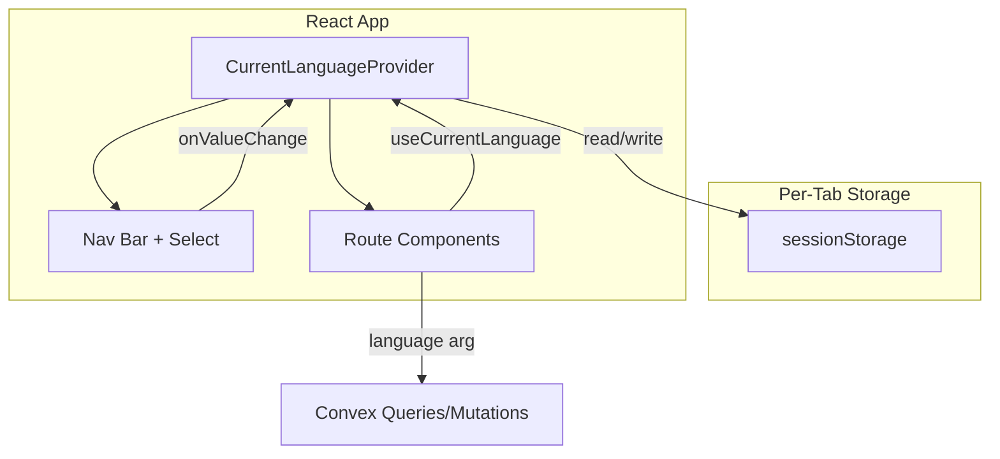

# Current Language Feature Implementation

## Summary

Add language selection to the app via a dropdown in the nav bar. The selection is stored per-tab (sessionStorage), exposed via React context, and used to filter all language-scoped data. Initial languages: French (fr) and English (en).

## Key Decisions

- **Storage**: `sessionStorage` (per-tab) as specified; `localStorage` would share state across tabs
- **Default**: `'en'` when no prior selection exists
- **Language names**: Display in the language itself (e.g. "Français", "English") as required

---

## 1. Language configuration and lookup

**File**: `src/lib/languages.ts`

- Define `LANGUAGES = [{ code: 'fr', name: 'Français' }, { code: 'en', name: 'English' }]`
- Export `getLanguageName(code: string): string` for code-to-name lookup (return code if unknown)
- Export `LANGUAGE_CODES` or similar for validation/iteration
- Use ISO 639 codes as values (`'fr'`, `'en'`)

---

## 2. Current Language React Context

**File**: `src/contexts/CurrentLanguageContext.tsx`

- Create `CurrentLanguageContext` with `{ language: string; setLanguage: (code: string) => void }`
- Provider logic:
  - Initial value from `sessionStorage.getItem('language-practice:current-language')` or `'en'`
  - `setLanguage` updates state and `sessionStorage.setItem(...)`
- Export `useCurrentLanguage()` hook that throws if used outside provider
- Validate selected code against supported languages; fall back to `'en'` if invalid

---

## 3. Wire Provider into app

**Files**: [src/main.tsx](src/main.tsx), [src/app/App.tsx](src/app/App.tsx)

- Wrap the app with `CurrentLanguageProvider` (inside `LinkProvider`, outside `RouterProvider`, or as sibling—Provider tree must include all routes)
- Place it so `AppLayout` and all route components can access the context

---

## 4. Language dropdown in nav bar

**File**: [src/app/AppLayout.tsx](src/app/AppLayout.tsx)

- Add a language dropdown on the **right side** of the nav bar (e.g. `ml-auto` on a flex container)
- Use Kumo `Select` from `@cloudflare/kumo`:
  - `value={language}` (from `useCurrentLanguage()`)
  - `onValueChange={setLanguage}`
  - `items={{ fr: 'Français', en: 'English' }}` or map from `LANGUAGES`
- Ensure accessibility: use `label` or `aria-label` (e.g. "Current language"); Kumo Select supports `label` prop
- Layout: `flex` on nav, `ml-auto` on dropdown container so it sits at the right

---

## 5. Convex integration pattern

**Convex**: No new functions required for this feature. Establish the pattern:

- Future queries/mutations that return language-scoped data will accept `language: v.string()` (or `v.union(v.literal('fr'), v.literal('en'))`) and filter by it
- Client call pattern: `useQuery(api.words.list, { language })` where `language` comes from `useCurrentLanguage()`
- Document this in [docs/ARCHITECTURE.md](docs/ARCHITECTURE.md) or [docs/DATA_MODEL.md](docs/DATA_MODEL.md)

---

## 6. Documentation updates

- **docs/DATA_MODEL.md**: Note that `words`, `questionTypes` (and related data) are filtered by `language`; the client passes the current language from context to all relevant Convex calls
- **docs/ARCHITECTURE.md**: Add a short section on "Current Language" describing the context, sessionStorage, and how routes/Convex receive the language

---

## Data flow (mermaid)

---

## Files to create

| File                                      | Purpose                                 |
| ----------------------------------------- | --------------------------------------- |
| `src/lib/languages.ts`                    | Language config + `getLanguageName`     |
| `src/contexts/CurrentLanguageContext.tsx` | Context, Provider, `useCurrentLanguage` |

## Files to modify

| File                    | Change                                   |
| ----------------------- | ---------------------------------------- |
| `src/main.tsx`          | Wrap app with `CurrentLanguageProvider`  |
| `src/app/AppLayout.tsx` | Add language Select on right side of nav |
| `docs/DATA_MODEL.md`    | Document language filtering              |
| `docs/ARCHITECTURE.md`  | Document Current Language flow           |

---

## Out of scope (for later)

- Convex schema and functions for words/questionTypes (covered by other features)
- `ConvexProvider` setup (if not yet present, will be needed when Convex queries are added; can be done as part of this or deferred)

