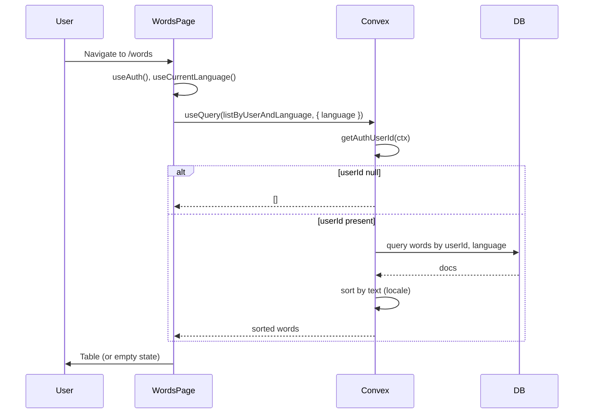

# Manage Words – implementation plan

## Scope (Current Requirements only)

- **Access**: Only words where `userId` = current user and `language` = current session language.
- **Route**: `/words` shows a table of those words, one row per word.
- **Order**: Ascending by word `text` using the standard collating sequence for the current language.
- **Columns**: `text`, `pos`, `gender`, `meaning`, `tags` (as in [docs/DATA_MODEL.md](docs/DATA_MODEL.md)).

No add/edit/delete or row selection in this phase.

---

## 1. Backend: list words query

**New file**: [convex/words.ts](convex/words.ts)

- **Query** (e.g. `listByUserAndLanguage`):
  - **Args**: `{ language: v.string() }` (client passes `language` from `useCurrentLanguage()`).
  - **Auth**: Use `getAuthUserId(ctx)`; if `null`, return `[]`.
  - **Read**: Use existing index `by_userId_language` on `words` to filter by `userId` and `language`.
  - **Sort**: In the handler, sort the result array by `text` using locale-aware comparison, e.g. `a.text.localeCompare(b.text, language)` (or `Intl.Collator(language).compare`), so order matches the “standard collating sequence” for that language.
  - **Return**: Sorted list of word documents (include all fields needed for the table: `text`, `pos`, `gender`, `meaning`, `tags`; plus `_id` if needed for keys).

Validation: keep args minimal; optional: validate `language` against allowed codes if desired.

---

## 2. Frontend: Words page and table

**Update**: [src/routes/WordsPage.tsx](src/routes/WordsPage.tsx)

- **Data**: `useAuth()` and `useCurrentLanguage()`; call `useQuery(api.words.listByUserAndLanguage, { language })`. When user is not logged in, the query still runs with `language` and returns `[]` (backend returns empty for null `userId`).
- **Loading**: Handle `words === undefined` (e.g. show a loading state or skeleton).
- **Table**: Use Kumo `Table` from `@cloudflare/kumo`:
  - **Header row**: Text, Part of speech, Gender, Meaning, Tags (or short labels).
  - **Body**: One `<Table.Row>` per word; each row uses `word._id` as `key`. Use `<Table.Cell>` for each column; display `word.text`, `word.pos`, `word.gender` (optional, show “—” or blank when absent), `word.meaning`, `word.tags` (optional, same).
- **Empty state**: When `words.length === 0`, show a single message (e.g. “No words yet” or “Log in to manage your words” when `!user`) so the table doesn’t look broken. Kumo’s `Empty` component is a good fit if available.
- **Accessibility**: Use semantic table structure (Table.Header, Table.Body, Table.Head, Table.Cell); ensure column headers are associated with the table (default with Kumo Table).

**Styling**: Tailwind + Kumo only; no new custom CSS. Keep the page consistent with [AppLayout](src/app/AppLayout.tsx) and [HomePage](src/routes/HomePage.tsx) (e.g. section, heading).

---

## 3. Docs

- ** [docs/ARCHITECTURE.md](docs/ARCHITECTURE.md)**: No structural change; “Words: manage word list” already listed.
- ** [docs/DATA_MODEL.md](docs/DATA_MODEL.md)**: No change; words schema and fields already described.
- ** [docs/features/Manage Words.md](docs/features/Manage Words.md)**: Optional short “Implemented” note under Current Requirements (e.g. “Implemented: list + table on /words”) for traceability.

---

## Data flow

---

## Out of scope (future)

- Pagination.
- Row selection, edit dialog, add/delete (from Future requirements).

---

## Definition of done (from project brief)

- `npm run typecheck` and `npm run lint` pass.
- UI: labels, focus, keyboard navigation preserved; table is accessible.
- Selection/display logic: list and sort live in Convex; route is a thin UI shell.
