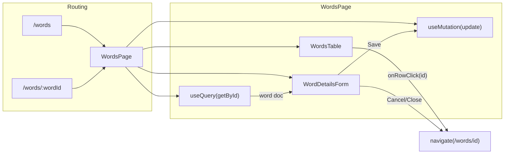

# Manage Words Part 3: Word details view and edit

## Scope (from [docs/features/Manage Words.md](docs/features/Manage Words.md))

- **View/edit**: User can view full details of a word and edit them.
- **Layout**: Row click opens details form; wide screen = table left + details right; small = details replace/overlay table.
- **Routing**: URL includes word id (e.g. `/words/:wordId`); deep link bookmarkable; back button works.
- **Form**: All word fields except userId/language (text, pos, gender, meaning, tags); Save / Cancel / Close (X); unsaved changes → confirm modal on Close, back, or selecting another row (Cancel does not confirm).

---

## 1. Backend: Convex API

**File:** [convex/words.ts](convex/words.ts)

- `**words.getById`** (query)  
  - Args: `wordId: v.id("words")`, `language: v.string()`.  
  - Returns: word document or `null`.  
  - Auth: require `getAuthUserId`; return `null` if unauthenticated.  
  - Access: return `null` if `word.userId !== userId` or `word.language !== language`.  
  - Use `ctx.db.get("words", args.wordId)` (no new index).
- `**words.update`** (mutation)  
  - Args: `wordId: v.id("words")`, `text: v.string()`, `pos: v.union(v.literal("noun"), v.literal("verb"), v.literal("adjective"))`, `gender: v.optional(v.union(v.literal("M"), v.literal("F"), v.literal("N")))`, `meaning: v.string()`, `tags: v.optional(v.string())`.  
  - Returns: `v.null()` (or document id if you prefer).  
  - Auth: require userId; verify word exists, `word.userId === userId`, and `word.language` unchanged (do not allow changing language).  
  - Update only the editable fields.

Follow existing patterns: validate args at boundary; keep handlers thin. Reuse schema-style validators (define `partOfSpeech` and `gender` in this file or share via a small validator module).

---

## 2. Routing

**File:** [src/app/router.tsx](src/app/router.tsx)

- Support optional word id so one component can serve both list and list+detail:
  - Change `path: "words"` to `path: "words/:wordId?"` so both `/words` and `/words/:wordId` render the same `WordsPage` (React Router allows optional params with `?`).

---

## 3. Words page layout and data

**File:** [src/routes/WordsPage.tsx](src/routes/WordsPage.tsx)

- Use `useParams()` to read `wordId`.
- Use `useQuery(api.words.getById, { wordId, language })` when `wordId` is present (skip query when `wordId` is undefined).
- Layout (e.g. CSS Grid or Flex + media query):
  - **Wide (e.g. md and up):** two columns — table (left), details form (right). If `wordId` present, show details in right column; optionally scroll table to selected row (e.g. ref on row or `scrollIntoView`).
  - **Narrow:** single column — when `wordId` present show only details (or overlay); when no `wordId` show only table.
- When `wordId` is in URL but `getById` returns `null` (wrong user/language or deleted), show an error state and a way to go back to `/words`.
- Pass to table: `words`, `selectedWordId: wordId ?? null`, and a way to navigate to a word (e.g. `onRowClick(wordId)` that calls `navigate(\`/words/${wordId})`).

---

## 4. Words table: row selection and navigation

**File:** [src/features/words/WordsTable.tsx](src/features/words/WordsTable.tsx)

- Add props: `selectedWordId: Id<"words"> | null`, `onRowClick: (wordId: Id<"words">) => void`.
- Make each row clickable: call `onRowClick(word._id)` on click; ensure keyboard support (e.g. `role="button"`, `tabIndex={0}`, `onKeyDown` for Enter/Space) or use a link that wraps the row content and looks like a row.
- Visually indicate selected row when `word._id === selectedWordId` (e.g. background or border).
- Optional: add `data-word-id` on the row for scroll-into-view (WordsPage can pass a ref or use `querySelector`).

---

## 5. Word details form component

**New file:** `src/features/words/WordDetailsForm.tsx`

- Props: `word: Doc<"words">`, `onSave: (payload) => Promise<void>`, `onCancel: () => void`, `onClose: () => void`.
- Form fields (per [DATA_MODEL.md](docs/DATA_MODEL.md)): text, pos (noun/verb/adjective), gender (M/F/N, optional), meaning, tags (optional). Use Kumo `Field`, `Input`, and appropriate controls (e.g. select or radio for pos/gender).
- Buttons: Save (submit), Cancel (calls `onCancel`), and Close (X icon, top-right, calls `onClose`). Use Kumo `Button` and a close icon (e.g. from `@phosphor-icons/react` if already used).
- Track dirty state: compare current form values to initial `word`. When dirty and user triggers `onClose`, or when parent signals “navigate away” (e.g. other row click / back), show a **confirm dialog** (Kumo `Dialog`): “Discard changes?” with options to cancel navigation or confirm discard. Cancel button does **not** show this dialog; it just calls `onCancel`.
- On successful Save, call `onSave` then parent navigates to `/words` (parent can do that after `onSave` resolves).

---

## 6. Unsaved-changes flow in WordsPage

**File:** [src/routes/WordsPage.tsx](src/routes/WordsPage.tsx)

- When user tries to:
  - click Close in the details form, or  
  - use browser back, or  
  - click another row in the table  
  and the form is dirty, show the same “Discard changes?” modal (either in WordDetailsForm or in WordsPage with a callback from the form like `onWantsToLeave(callbackThatActuallyLeaves)`).
- Recommended: let **WordDetailsForm** own the dirty state and the confirm dialog; it calls `onClose`/`onCancel` only when not dirty or after user confirms discard. For “navigate to another row” or “back”, WordsPage can pass a single “navigate to” callback that the form can intercept when dirty (e.g. `onNavigateTo(wordId)` that form can replace with “request confirm then navigate”).

---

## 7. Unit tests (write first, expect failure)

### 7.1 Convex: getById and update

**File:** [convex/words.test.ts](convex/words.test.ts)

- **getById**
  - Returns `null` when unauthenticated.
  - Returns `null` when word exists but belongs to another user.
  - Returns `null` when word exists and is owned but language does not match args.
  - Returns the word when authenticated, owner, and language matches.
- **update**
  - Fails or returns without updating when unauthenticated (expect no change to DB or throw).
  - Fails when word belongs to another user.
  - Succeeds when owner and updates only editable fields (text, pos, gender, meaning, tags); language and userId unchanged.

Reuse existing test helpers (`createUserAndSession`, `asUser`) and insert words with full fields where needed. Run with `npm run test` (or `vitest run`) for Convex tests; ensure these tests **fail** until `getById` and `update` are implemented.

### 7.2 WordsTable: row click

**File:** [src/features/words/WordsTable.test.tsx](src/features/words/WordsTable.test.tsx)

- Add test: “calls onRowClick with word _id when a row is clicked” (and optionally “applies selected row styling when selectedWordId matches”).  
- Use `customRender` and a mock `onRowClick`; click the first data row and assert `onRowClick` was called with that word’s `_id`.  
- This will fail until `WordsTable` accepts `selectedWordId`, `onRowClick`, and implements row click + selection styling.

### 7.3 WordDetailsForm

**New file:** `src/features/words/WordDetailsForm.test.tsx`

- Render form with a mock word (all fields set).
- Assert all fields are present and show the word’s values (text, pos, gender, meaning, tags).
- Save: change a field, click Save, assert the submit handler (e.g. `onSave`) is called with the updated payload (and that payload matches Convex update shape).
- Cancel: click Cancel, assert `onCancel` is called (and no Save).
- Close: click Close (X), assert `onClose` is called when form is not dirty; when form is dirty, assert confirm dialog appears and that confirming calls `onClose` (or the navigation callback).
- Optional: test that Cancel does not open the discard-confirm dialog.

Use a mock word and `customRender`; mock `onSave`, `onCancel`, `onClose`. These tests fail until `WordDetailsForm` exists and implements the behavior.

### 7.4 WordsPage: routing and detail visibility

**New file:** `src/routes/WordsPage.test.tsx` (or under `src/features/words/` if you prefer)

- Mock `convex/react`: `useQuery` returns a word when `wordId` is in the args, otherwise list of words; `useMutation` returns a no-op function.
- Render WordsPage with router (e.g. `MemoryRouter` + route `/words`). Assert table is present, no details form (or no word detail panel).
- Render with initial entry `/words/:wordId` and mock `getById` to return a word. Assert details form (or word detail content) is visible and table is visible on wide layout if applicable.
- Optional: test that after “Save”, navigation goes back to `/words` (mock `useMutation` to resolve, then assert location or that form is no longer shown).

Run front-end tests with `npm run test`; ensure they **fail** until the corresponding production code is in place.

---

## 8. Test run order (TDD)

1. Add the Convex tests; run `npm run test` (or `vitest run convex/words.test.ts`) → expect failures for `getById` and `update`.
2. Implement `words.getById` and `words.update` → Convex tests pass.
3. Add WordsTable test (onRowClick / selectedWordId) → expect failure.
4. Update WordsTable with `onRowClick`, `selectedWordId`, row click and selection UI → test passes.
5. Add WordDetailsForm tests → expect failures.
6. Implement WordDetailsForm (form, Save/Cancel/Close, dirty + confirm) → tests pass.
7. Add WordsPage routing/layout tests (with mocks) → expect failures.
8. Implement router change, WordsPage layout, integration with WordDetailsForm and table, and unsaved-changes handling → tests pass.

---

## 9. Docs and polish

- **docs/ARCHITECTURE.md**: Briefly mention words detail view and that word edit is done via Convex mutation.
- **docs/DATA_MODEL.md**: No schema change; optional note that word updates go through `words.update` and are scoped by userId.

---

## 10. Diagram (overview)

---

## Files to add

| Path                                          | Purpose                                                    |
| --------------------------------------------- | ---------------------------------------------------------- |
| `src/features/words/WordDetailsForm.tsx`      | Detail form with fields, Save/Cancel/Close, dirty confirm  |
| `src/features/words/WordDetailsForm.test.tsx` | Unit tests for form behavior                               |
| `src/routes/WordsPage.test.tsx`               | Tests for URL/layout and detail visibility (mocked Convex) |

## Files to change

| Path                                     | Changes                                                              |
| ---------------------------------------- | -------------------------------------------------------------------- |
| `convex/words.ts`                        | Add `getById` query and `update` mutation                            |
| `convex/words.test.ts`                   | Add tests for `getById` and `update`                                 |
| `src/app/router.tsx`                     | Optional param: `words/:wordId?`                                     |
| `src/routes/WordsPage.tsx`               | Params, getById/update usage, layout, table + form, unsaved handling |
| `src/features/words/WordsTable.tsx`      | `selectedWordId`, `onRowClick`, row click + selection styling        |
| `src/features/words/WordsTable.test.tsx` | Test row click and selection                                         |
| `docs/ARCHITECTURE.md`                   | Short note on words detail/edit                                      |

No new Convex indexes are required for `getById` (primary key lookup).