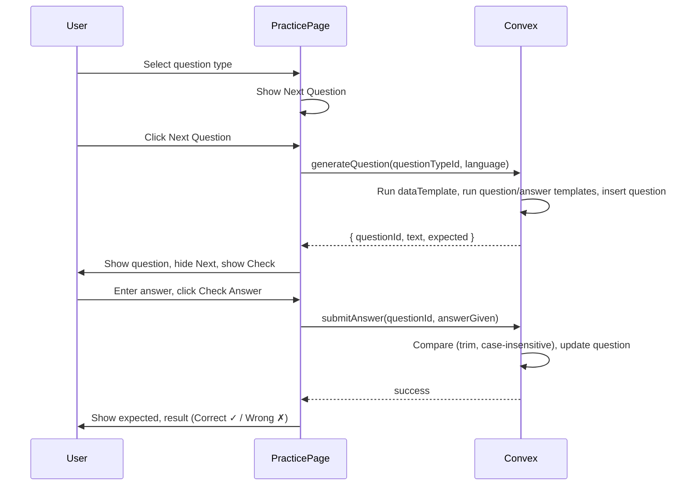

# Practice Questions – Stage 1 Implementation Plan

## Summary

Build the Practice page with a question-type selector, full Handlebars pipeline (dataTemplate with storeData → questionTemplate/answerTemplate), answer input and check flow, and storage of results in the `questions` table. Answer comparison is trim + case-insensitive. No `handlebars-async-helpers`; use the storeData prototype (async helper, flush microtasks).

---

## Clarifications (resolved)


| #   | Question           | Answer                                                                                                                                                                                                                  |
| --- | ------------------ | ----------------------------------------------------------------------------------------------------------------------------------------------------------------------------------------------------------------------- |
| 1   | Word selection     | `randomWord` helper comes in a later stage. In Stage 1, `word` helper looks up a known word by its `text` field. Initial context for data step is provided by the implementation (e.g. empty `{}` for fixed questions). |
| 2   | dataTemplate       | Option A: Full implementation (dataTemplate → storeData → question/answer).                                                                                                                                             |
| 3   | Schema             | Add `expected`, rename `questionText` → `text`.                                                                                                                                                                         |
| 4   | Empty dataTemplate | Pass `{}` to question/answer templates. User may create fixed questions with no data.                                                                                                                                   |
| 5   | Async helpers      | No `handlebars-async-helpers`. Use the user's storeData prototype (async helper, await value).                                                                                                                          |


---

## 1. Schema Update

**File:** [convex/schema.ts](convex/schema.ts)

- Add `expected: v.string()` to the `questions` table.
- Rename `questionText` → `text` (align with DATA_MODEL.md).
- Make `answerGiven`, `isCorrect`, `respondedAt` optional (set on insert by generateQuestion as needed, or optional until submitAnswer updates them).
- Update any existing references.

---

## 2. Convex Backend

### 2.1 Word lookup by text

**File:** [convex/words.ts](convex/words.ts)

Add internal helper for looking up the first word by `text` for the current user and language:

- Used by the `word` helper during template execution.
- Returns `Promise<{ text, meaning } | null>` (async, since it queries the DB).

### 2.2 Question Generation Module

**New file:** `convex/questionGeneration.ts` (internal helper module)

Use the **storeData prototype** (async helper, await value). No handlebars-async-helpers. Flush microtasks after running the template so storeData completes.

```ts
let data: Record<string, unknown> = {};
const storeData = async (key: string, value: unknown) => {
  data[key] = await value;
};
const handlebars = Handlebars.create();
handlebars.registerHelper("storeData", storeData);
handlebars.registerHelper("word", function (options) {
  const text = options.hash.text;
  return lookupWordByText(ctx, userId, language, text);
});
const template = handlebars.compile(transformedDataTemplate);
template(initialContext, { helpers: { storeData } });
await new Promise((r) => setTimeout(r, 0)); // flush microtasks
```

#### Data step

- **Input:** `dataTemplate`, initial context (e.g. `{}` for fixed questions; implementation-defined for word-based templates), plus `ctx`, `userId`, `language` for the word helper.
- **Empty dataTemplate:** If trim is empty, skip the data step and use `{}` for the question/answer step.
- **Transformation:** Each line `<name> = <data-expression>` becomes `{{{storeData "<name>" ( <data-expression>)}}}` (triple braces, per prototype).
- **storeData helper:** `async (key, value) => { data[key] = await value }`—awaits value (which may be a Promise), stores in dictionary.
- **word helper:** Named arg `text`. Calls `lookupWordByText(ctx, userId, language, text)`, returns `Promise<{ text, meaning } | null>`.
- Run the transformed template; then `await new Promise(r => setTimeout(r, 0))` to flush microtasks; then use `data` for the question/answer step.

#### Question/answer step

- **Input:** Data dictionary from the data step, `questionTemplate`, `answerTemplate`.
- Do **not** register the `word` helper here—it is async and will not work in the sync question/answer templates.
- Create isolated Handlebars instance, compile both templates, run with the data dictionary (sync; data already resolved).
- Templates use only the stored data (e.g. `{{word.text}}`, `{{word.meaning}}`).
- Return `{ text, expected }`.

#### Error handling

- Catch Handlebars compile/runtime errors; return a clear error to the caller.

### 2.3 Practice API

**New file:** `convex/practice.ts`

- **generateQuestion(questionTypeId, language)** (mutation):
  - Auth + language validation.
  - Load question type; verify ownership.
  - Call question generation (data step, then question/answer step).
  - Insert into `questions` table (userId, questionTypeId, text, expected, language, etc.).
  - Return `{ questionId, text, expected }` to the client.
- **submitAnswer(args)** (mutation):
  - Args: `questionId`, `answerGiven`.
  - Auth + validation.
  - Compute `isCorrect`: `answerGiven.trim().toLowerCase() === expected.trim().toLowerCase()` (compare with stored expected).
  - Update the `questions` record with `answerGiven`, `isCorrect`, `respondedAt`.

### 2.4 Question types

Reuse `api.questionTypes.listByUserAndLanguage` from the client. No new query needed.

---

## 3. Frontend – Practice Page

**File:** [src/routes/PracticePage.tsx](src/routes/PracticePage.tsx)

### 3.1 UI Elements (from spec)


| Element                   | Description                                        |
| ------------------------- | -------------------------------------------------- |
| Question type select      | All question types for current user and language   |
| Question paragraph        | Bordered, label "Question", initially empty        |
| Answer textarea           | Label "Answer"                                     |
| Expected Answer paragraph | Bordered, label "Expected Answer", initially empty |
| Result paragraph          | Bordered, initially empty                          |
| Next Question button      | Initially hidden                                   |
| Check Answer button       | Initially hidden                                   |


### 3.2 Visibility rules

- Both buttons initially hidden.
- When user selects a question type → show Next Question.
- When user clicks Next Question → show question text, hide Next Question, show Check Answer.
- When user clicks Check Answer → show expected answer and result (✓ / ✗), hide Check Answer, show Next Question.
- Cycle repeats.

### 3.3 State and flow

- Local state: `selectedQuestionTypeId`, `currentQuestion` (`{ questionId, text, expected }`), `answer`, `feedback` (`{ isCorrect }` or null).
- **Next Question:** Call `practice.generateQuestion`; store result; clear answer and feedback.
- **Check Answer:** Call `practice.submitAnswer`; show expected and result.
- Handle empty: no question types → "Add question types to practice".

### 3.4 Styling

- Kumo components (Select, Button, Field, Text) + Tailwind.
- Bordered blocks: `border border-slate-200 rounded-lg p-3` or similar.
- Accessible labels and focus management.

---

## 4. Data Flow




---

## 5. Template authoring example

Example with `{ wordText: "chat" }` as initial context:

**dataTemplate:**

```
word = (word text=wordText)
```

**questionTemplate:** `What is the meaning of {{#with word}}{{text}}{{/with}}?`

**answerTemplate:** `{{#with word}}{{meaning}}{{/with}}`

(Question/answer templates use only the stored data from the data step; no `word` helper there.)

---

## 6. Edge cases


| Case                     | Handling                                                |
| ------------------------ | ------------------------------------------------------- |
| No question types        | Message: add question types to practice                 |
| Template errors          | Catch in generation, return clear error                 |
| Word helper returns null | Template may output nothing; use `{{#with (word ...)}}` |
| Empty dataTemplate       | Pass `{}` to question/answer step                       |


---

## 7. Documentation

- [docs/DATA_MODEL.md](docs/DATA_MODEL.md): Ensure `questions` has `text`, `expected` and matches schema.
- [docs/features/Practice Questions.md](docs/features/Practice%20Questions.md): Add Stage 1 implementation notes (word helper, dataTemplate, empty-handling).

---

## 8. Dependencies

- Add `handlebars` to `package.json` (and `@types/handlebars` if needed).

---

## 9. File summary


| Action  | File                                                                |
| ------- | ------------------------------------------------------------------- |
| Modify  | `convex/schema.ts` – add `expected`, rename `questionText` → `text` |
| Modify  | `convex/words.ts` – add word-by-text lookup (internal or query)     |
| Create  | `convex/questionGeneration.ts` – data step + question/answer step   |
| Create  | `convex/practice.ts` – `generateQuestion`, `submitAnswer`           |
| Rewrite | `src/routes/PracticePage.tsx` – full UI and flow                    |
| Update  | `docs/DATA_MODEL.md` – align `questions` fields                     |
| Update  | `docs/features/Practice Questions.md` – Stage 1 notes               |
| Add     | `handlebars` to package.json                                        |


