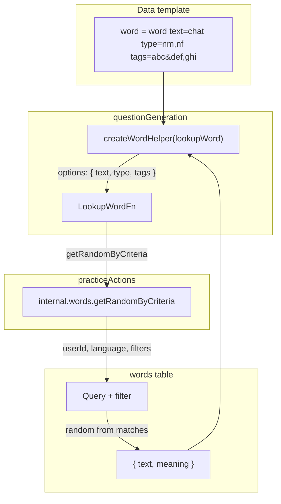

# Practice Questions Stage 2 – Random Word Selection by Properties

## Summary

Extend the `word` Handlebars helper to accept optional `text`, `type`, and `tags` hash options. When multiple words match the criteria, select one at random. Refactor the helper for testability.

## Current State

- [convex/questionGeneration.ts](convex/questionGeneration.ts): `LookupWordFn` takes `(text: string)`; word helper passes `options.hash.text` to it
- [convex/practiceActions.ts](convex/practiceActions.ts): Passes `lookupWord` that calls `internal.words.getFirstByText` with `{ userId, language, text }`
- [convex/words.ts](convex/words.ts): `getFirstByText` queries by `userId` + `language` (index), filters by exact `text`, returns first match
- Words schema: `text`, `type` (WordType), `meaning`, `tags` (optional, space-separated)

## Matching Logic (from requirements)


| Option | Format                                                                       | Match rule                                                                                                                |
| ------ | ---------------------------------------------------------------------------- | ------------------------------------------------------------------------------------------------------------------------- |
| `text` | Comma-separated list (e.g. `chat,chaise`)                                    | Word's `text` is one of the values                                                                                        |
| `type` | Comma-separated list (e.g. `nm,nf`)                                          | Word's `type` is one of the values                                                                                        |
| `tags` | Tag groups joined by `&`; each group is comma-separated (e.g. `abc&ghi,jkl`) | For **each** group, **at least one** tag in the group must appear in the word's tags (split on spaces). AND across groups |


**Tags example:** `abc&ghi,jkl` → groups `["abc"]` and `["ghi","jkl"]`. Record `abc ghi xyz` matches (has abc, has ghi). Record `ghi pqr` does not (missing abc).

**No options:** Select randomly from all words for user + language.

## Implementation Plan

### 1. Refactor questionGeneration – create word helper factory

**File:** [convex/questionGeneration.ts](convex/questionGeneration.ts)

- Change `LookupWordFn` to accept an options object:

```ts
  export type WordLookupOptions = {
    text?: string;
    type?: string;
    tags?: string;
  };
  export type LookupWordFn = (
    options: WordLookupOptions
  ) => Promise<{ text: string; meaning: string } | null>;
  

```

- Add `createWordHelper(lookupWord: LookupWordFn)` that:
  - Reads `options.hash` from the Handlebars helper context
  - Extracts `text`, `type`, `tags` (all optional strings)
  - Returns `lookupWord({ text, type, tags })`
- In `runDataStep`, replace the inline helper with:

```ts
  handlebars.registerHelper("word", createWordHelper(lookupWord));
  

```

### 2. Add Convex query for random word lookup

**File:** [convex/words.ts](convex/words.ts)

- Add internal query `getRandomByCriteria`:
  - Args: `userId`, `language`, optional `text`, `type`, `tags`
  - Use index `by_userId_language` to get candidates
  - Apply filters in memory (Convex queries can't do complex OR/AND easily in filters; collect and filter):
    - `text`: if provided, split on `,`, trim; word matches if `word.text` is in the list
    - `type`: if provided, split on `,`, trim; word matches if `word.type` is in the list
    - `tags`: if provided, split on `&` → tag groups; for each group, split on `,`; word matches iff for every group, at least one tag in the group is in `(word.tags ?? "").split(/\s+/)`
  - If no options provided, all words for user+language are candidates
  - From matching words, pick one at random (e.g. `candidates[Math.floor(Math.random() * candidates.length)]`)
  - Return `{ text, meaning } | null` (or `{ _id, text, meaning }` if we later want `wordId` for questions)
- Keep `getFirstByText` for backward compatibility if needed, or remove it and update callers.

### 3. Update practiceActions

**File:** [convex/practiceActions.ts](convex/practiceActions.ts)

- Replace `lookupWord` implementation:

```ts
  const lookupWord = (options: WordLookupOptions) =>
    ctx.runQuery(internal.words.getRandomByCriteria, {
      userId,
      language: args.language,
      ...options,
    }) as Promise<{ text: string; meaning: string } | null>;
  

```

### 4. Unit tests for questionGeneration

**File:** [convex/questionGeneration.test.ts](convex/questionGeneration.test.ts)

- **New file or section:** Tests for `createWordHelper` (or test via `generateQuestion`):
  - Helper with `text` only (backward compat): `word text="chat"` → lookup receives `{ text: "chat" }`
  - Helper with `type` only: `word type="nm,nf"` → lookup receives `{ type: "nm,nf" }`
  - Helper with `tags` only: `word tags="abc&ghi,jkl"` → lookup receives `{ tags: "abc&ghi,jkl" }`
  - Helper with multiple options: `word text="chat" type="nm"` → lookup receives both
  - Helper with no options: lookup receives `{}` → returns random word (mock returns one)
  - Options passed through correctly to `LookupWordFn`
- Update existing tests: `LookupWordFn` signature change means tests that pass `(text) => ...` must change to `(opts) => opts.text === "chat" ? ... : null`.

### 5. Convex / integration tests

**File:** [convex/words.test.ts](convex/words.test.ts) (or new `convex/wordLookup.test.ts`)

- Add tests for `getRandomByCriteria`:
  - By `text`: single value, comma-separated list
  - By `type`: single, list
  - By `tags`: one group, multiple groups (AND semantics)
  - No options: returns one of the user's words
  - No matches: returns null
  - Verify random selection (e.g. run multiple times with 2+ matches, ensure different results can occur)

**File:** [convex/practice.test.ts](convex/practice.test.ts)

- Add or extend action test: generate question with dataTemplate using `word type="nm"` (or similar) and verify question/answer uses the selected word.

### 6. Documentation

- [docs/features/Practice Questions.md](docs/features/Practice Questions.md): Update implementation notes for Stage 2 (word helper options, matching rules).
- [docs/DATA_MODEL.md](docs/DATA_MODEL.md): No schema changes; optional note on word lookup criteria.

## Data Flow (mermaid)




## Index Consideration

The existing `by_userId_language` index is sufficient. Filtering by `text`, `type`, and `tags` happens in memory after fetching candidates. For large word sets (1000+), consider adding indexes later; current approach keeps the implementation simple and matches the existing pattern.

## Edge Cases to Handle

- Empty string for an option: treat as "not provided" (omit from lookup)
- Word with `tags: undefined` or `""`: equivalent to no tags; tag groups require at least one match, so record with no tags only matches if no `tags` option is given
- All options provided but no matches: return null (same as Stage 1)

