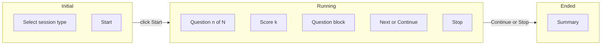

# Practice Sessions Implementation

## Data model and schema

- **New table `sessions`** ([convex/schema.ts](convex/schema.ts)): `userId`, `language`, `sessionTypeId`, `numberCorrect` (optional, set when session ends). Index: `by_userId` (and optionally `by_userId_language` if we need language-scoped listing later).
- **Extend `questions`**: Add optional `sessionId: v.optional(v.id("sessions"))`. Add index `by_sessionId` on `["sessionId"]` so we can query and sort by `_creationTime` for order.
- **Docs**: Update [docs/DATA_MODEL.md](docs/DATA_MODEL.md) to reflect that `sessions` and `questions.sessionId` are implemented (already described there; ensure index notes mention `questions by sessionId`).

## Backend (Convex)

- `**practiceInternal.insertGeneratedQuestion`** ([convex/practiceInternal.ts](convex/practiceInternal.ts)): Add optional arg `sessionId: v.optional(v.id("sessions"))` and persist it on the inserted question.
- `**practiceActions.generateQuestion`** ([convex/practiceActions.ts](convex/practiceActions.ts)): When called with optional `sessionId`, pass it through to `insertGeneratedQuestion` (keeps single-question practice unchanged).
- **New module `convex/sessions.ts`**:
  - `**generateSession**` (action): Args `sessionTypeId`, `language`, `userLanguage` (optional). Auth via internal getAuthUserId; load session type (validate user + language). Insert one `sessions` record. For each item in `sessionType.questions`, loop `count` times: call the same question-generation path as `practiceActions.generateQuestion` (reuse `getAuthAndQuestionType`, word lookup, `runQuestionGeneration`, `insertGeneratedQuestion`) but pass `sessionId` into `insertGeneratedQuestion`. Return `{ sessionId, questionIds }` (ordered) so the client can load questions.
  - `**getWithQuestions**` (query): Args `sessionId`, `language`. Auth; verify session belongs to user and language. Return session doc plus questions for that session ordered by `_creationTime` (query by index `by_sessionId`, then sort in memory if needed).
  - `**endSession**` (mutation): Args `sessionId`. Auth; verify session belongs to user. Count questions for this session where `respondedAt` is set and `isCorrect === true`; patch session with `numberCorrect`. Return null.
- **Internal orchestration**: `generateSession` can call an internal action that runs the per-question generation (to avoid duplicating template/word logic), or call `ctx.runAction(api.practiceActions.generateQuestion, …)` with a new optional `sessionId` argument. Prefer reusing the existing action with an optional `sessionId` so generation and insertion stay in one place; the action then calls `insertGeneratedQuestion` with `sessionId` when provided.

## Frontend – shared question component

- **Extract shared component** (e.g. [src/components/PracticeQuestionBlock.tsx](src/components/PracticeQuestionBlock.tsx) or under `src/features/practice/`): Renders the same layout as the current Practice page: labelled “Question” block, “Answer” textarea, “Expected Answer” block, “Result” block (Correct/Wrong with icon), and “Check Answer” button. Props: `questionText`, `expectedAnswer`, `answer`, `onAnswerChange`, `feedback` (null | { isCorrect }), `onCheckAnswer`, `disabled`/`loading` as needed, and **action slot** (e.g. `children` or `actionButton`) for “Next Question” vs “Next”/“Continue”. Labels and aria attributes preserved for accessibility.
- **Refactor [src/routes/PracticePage.tsx](src/routes/PracticePage.tsx)**: Use the shared component; pass “Next Question” as the action button and keep existing reducer + `generateQuestion`/`submitAnswer` flow.

## Frontend – Practice Session page

- **New route**: `path: "practice/session"`, element `PracticeSessionPage` (e.g. [src/routes/PracticeSessionPage.tsx](src/routes/PracticeSessionPage.tsx)). Register in [src/app/router.tsx](src/app/router.tsx).
- **Nav bar and menu**: Add a “Practice Session” entry to the main nav and hamburger menu in [src/app/AppLayout.tsx](src/app/AppLayout.tsx) (same pattern as “Practice”, “Words”, etc.) that navigates to `/practice/session`.
- **States**:
  - **Initial**: Session type select (same pattern as [SessionTypesPage](src/routes/SessionTypesPage.tsx) / [PracticePage](src/routes/PracticePage.tsx): `sessionTypes.listByUserAndLanguage`), “Start” button (disabled until a session type is selected), instruction “Choose a session type and click Start”.
  - **Running**: On “Start”, call `generateSession(sessionTypeId, language, userLanguage)`; store `sessionId` and `questionIds` (or refetch via `sessions.getWithQuestions`). Select becomes read-only; “Start” replaced by “Stop”. Heading: “Question n of count” and “Score k” (k = count of correct so far, from local state or from questions). Question area uses the shared component; primary button is “Next” (or “Continue” on last question after feedback). “Continue” when all answered: call `endSession(sessionId)`, transition to ended. “Stop”: call `endSession(sessionId)` (counts only answered questions), transition to ended.
  - **Ended**: Replace heading and question area with summary: number answered, number correct, percentage correct. No further actions required on this screen (could add “Start another session” later).
- **Data**: Use `useQuery(api.sessions.getWithQuestions, { sessionId, language })` when `sessionId` is set to get session + ordered questions; use first unanswered question index for “current” and derive score from questions that have `respondedAt`/`isCorrect`. After each `submitAnswer`, the query will re-run and score updates.

## Docs and polish

- Update [docs/ARCHITECTURE.md](docs/ARCHITECTURE.md): Mention Practice Session page and `sessions` / `generateSession` / `endSession`. Optionally update [docs/features/Practice Sessions.md](docs/features/Practice Sessions.md) with “Implemented” notes.
- Run `pnpm run typecheck` and `pnpm run lint`; fix any issues. Ensure labels and focus behaviour remain accessible.

## Flow summary

- **Generate session**: One new `sessions` row; for each (questionTypeId, count) in session type, generate `count` questions via existing generation path, each with `sessionId` set.
- **End session**: `endSession(sessionId)` counts correct answers and patches `sessions.numberCorrect`.

## Implementation order

1. Schema: `sessions` table, `questions.sessionId` + index.
2. Convex: `insertGeneratedQuestion` + `generateQuestion` accept optional `sessionId`; add `sessions.ts` (generateSession action, getWithQuestions query, endSession mutation).
3. Shared component: Extract question block; refactor PracticePage to use it.
4. PracticeSessionPage: Route, three-state UI, wire generateSession / getWithQuestions / submitAnswer / endSession.
5. Add “Practice Session” to nav bar and hamburger in AppLayout; link from Practice page to `/practice/session` optional; docs and lint/typecheck.

