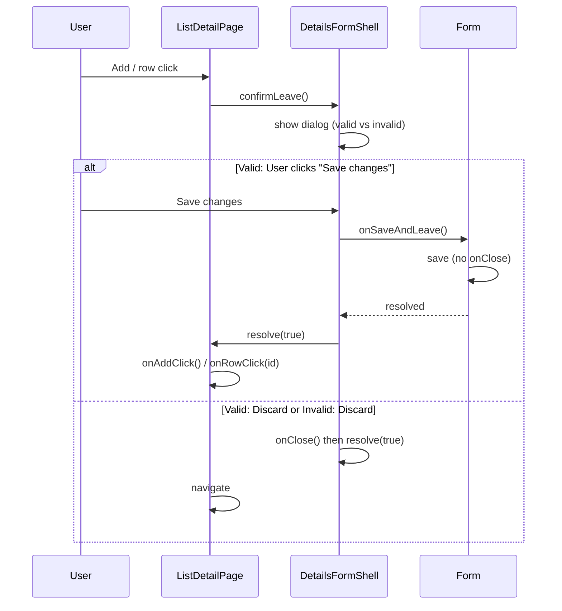

# Save-or-discard leave confirmation dialog

## Current behavior

- [DetailsFormShell.tsx](src/components/DetailsFormShell.tsx) shows a single dialog when the user tries to leave with unsaved changes (close button, or navigation from [ListDetailPage](src/components/ListDetailPage.tsx) via Add/row click).
- Dialog: title "Discard changes?", description "You have unsaved changes. Do you want to discard them?", buttons "Keep editing" (secondary) and "Discard changes" (primary).
- `confirmLeave()` returns `Promise<boolean>`: `true` = allow navigation, `false` = stay. On "Discard", the shell calls `onClose()` then resolves `true`; the parent then runs `onRowClick(id)` or `onAddClick()`.

## Desired behavior

| Form state                      | Dialog title       | Description                                              | Buttons                                                                           |
| ------------------------------- | ------------------ | -------------------------------------------------------- | --------------------------------------------------------------------------------- |
| **Valid** (`!isSubmitDisabled`) | "Save changes?"    | "You have unsaved changes. Do you want to save them?"    | **Save changes** (primary), Discard changes (secondary), Keep editing (secondary) |
| **Invalid**                     | "Discard changes?" | "You have unsaved changes. Do you want to discard them?" | Keep editing (secondary), Discard changes (primary) — *unchanged*                 |

When the user chooses **Save changes** (valid case): run save (without closing), resolve `confirmLeave()` with `true`, close dialog; parent then performs the requested navigation (Add or row). So save must not call `onClose()` in this path — the page’s `handleSave` currently calls `goToWords()`/`goToQuestionTypes()` after save, so we need a separate “save without navigate” path used only by this dialog.

## Architecture

## Implementation plan

### 1. DetailsFormShell: two dialog variants and Save-then-leave

**File:** [src/components/DetailsFormShell.tsx](src/components/DetailsFormShell.tsx)

- Add optional prop: `onSaveAndLeave?: () => Promise<void>`. When provided and the form is valid, the “Save changes” path is available.
- Derive dialog variant from `isSubmitDisabled` and `onSaveAndLeave`:
  - **Valid** (`!isSubmitDisabled` and `onSaveAndLeave` provided): show “Save changes?” dialog with three actions.
  - **Invalid** (or no `onSaveAndLeave`): show existing “Discard changes?” dialog (two actions).
- Copy for the valid dialog:
  - Title: `"Save changes?"`
  - Description: `"You have unsaved changes. Do you want to save them?"`
  - Buttons: **Save changes** (primary), Discard changes (secondary), Keep editing (secondary). Order: primary first, then secondary (e.g. Save changes | Discard changes | Keep editing).
- “Save changes” handler:
  - Call `await onSaveAndLeave()` (disable buttons or show loading during save if desired).
  - On success: clear pending resolve, `setShowDiscardConfirm(false)`, then `pendingLeaveResolveRef.current?.(true)` so the parent can navigate. Do **not** call `onClose()` — the parent will navigate.
- Keep existing “Discard” and “Keep editing” behavior for both dialogs; for the valid dialog, “Discard” still calls `onClose()` and resolves `true` as today.

### 2. Detail forms: expose save-without-close

**Files:** [src/features/words/WordDetailsForm.tsx](src/features/words/WordDetailsForm.tsx), [src/features/questionTypes/QuestionTypeDetailsForm.tsx](src/features/questionTypes/QuestionTypeDetailsForm.tsx)

- Each form already has `handleSubmit` (validates, calls `onSave`, then `onClose()`). Add a separate function that performs the same validation and `onSave` call but **does not** call `onClose()` (e.g. `saveWithoutClose` or inline in a callback).
- Pass this into `DetailsFormShell` as `onSaveAndLeave`: only when the form can save (same condition as submit: valid + not submitting), so the shell receives a `() => Promise<void>` that resolves when the mutation completes.
- Ensure `onSaveAndLeave` is only called when `!isSubmitDisabled` (shell already branches on this for which dialog to show; keep “Save changes” button disabled when `isSubmitting` so we don’t double-submit).

### 3. ListDetailPage

- No changes required. It already awaits `confirmLeave()` and, on `true`, runs `onAddClick()` or `onRowClick(id)`. After “Save changes”, the shell will resolve `true` without calling `onClose()`, so the parent will correctly perform the pending navigation.

### 4. Page-level save behavior

- [WordsPage](src/routes/WordsPage.tsx) and [QuestionTypesPage](src/routes/QuestionTypesPage.tsx) pass `onSave={handleSave}` and `onClose={goToWords}` / `goToQuestionTypes`. The form’s normal submit calls `onSave` then `onClose()`, so list navigation after save is unchanged.
- For “Save and leave”, the form will call the same `onSave(payload)` (or a wrapper that doesn’t call `onClose()`). So the page’s `handleSave` will run and currently calls `goToWords()` at the end — that would navigate away before the parent runs `onRowClick(id)`. So we must **not** have the “save and leave” path call the same `handleSave` that navigates. Options:
  - **A)** Pages pass a second callback, e.g. `onSaveOnly`, that performs the mutation but does not navigate; the form uses `onSaveOnly` for `onSaveAndLeave` and `onSave` for normal submit (which then calls `onClose()`). ListDetailPage doesn’t need to know; the form passes `onSaveAndLeave` that uses `onSaveOnly` when provided.
  - **B)** Form’s `onSaveAndLeave` calls the same `onSave` but the page’s `handleSave` accepts an option like `navigateAfter: boolean` and only calls `goToWords()` when true; form’s submit passes `navigateAfter: true`, shell’s save-and-leave path calls a wrapper that passes `navigateAfter: false`.

Recommended: **A**. Add `onSaveOnly?: (payload) => Promise<void>` to both detail forms. Pages implement `onSaveOnly` as the same mutation as `handleSave` but without the final `goToWords()`/`goToQuestionTypes()`. Form passes `onSaveAndLeave: () => saveWithoutClose()` where `saveWithoutClose` uses `onSaveOnly ?? onSave` and does not call `onClose()`. When `onSaveOnly` is not provided, `onSaveAndLeave` can be left unset so the shell falls back to the two-button “Discard?” dialog.

- **Simpler alternative:** Have the form accept a single `onSave` and an optional `onSaveWithoutNavigate?: (payload) => Promise<void>`. For “Save and leave”, the form calls `onSaveWithoutNavigate` if provided, otherwise it cannot offer the third button. Pages pass `onSaveWithoutNavigate` that runs the mutation only (no `goToWords()`). So: add `onSaveWithoutNavigate` to both forms; in the form, `onSaveAndLeave` is implemented as “build payload, validate, call `onSaveWithoutNavigate(payload)`” and pass that to the shell. No change to `onSave`/`onClose` contract.

### 5. Tests

- **DetailsFormShell**: If there is a unit test file for the shell, add cases: (1) when valid and `onSaveAndLeave` provided, dialog shows “Save changes?” and three buttons; (2) “Save changes” calls `onSaveAndLeave` and resolves leave with true; (3) when invalid, dialog is “Discard changes?” with two buttons.
- **WordsPage.test.tsx** ([src/routes/WordsPage.test.tsx](src/routes/WordsPage.test.tsx)): Existing test “shows discard confirm dialog when Add is clicked with unsaved changes, then navigates to new word on Discard” uses valid edits; update to assert the new dialog title/copy when valid, and add a test that “Save changes” saves then navigates (e.g. mock mutation, click Add with valid unsaved changes, click “Save changes”, assert mutation called and then navigation to New Word).
- **QuestionTypesPage.test.tsx** ([src/routes/QuestionTypesPage.test.tsx](src/routes/QuestionTypesPage.test.tsx)): Same idea — update discard test for new copy when valid; add test for “Save changes” with valid unsaved edits.
- Add a test for **invalid** form: e.g. clear required field, trigger leave — dialog should be “Discard changes?” with no “Save changes” button.

## File change summary

| File                                                                                                             | Changes                                                                                                                                                                                                                    |
| ---------------------------------------------------------------------------------------------------------------- | -------------------------------------------------------------------------------------------------------------------------------------------------------------------------------------------------------------------------- |
| [src/components/DetailsFormShell.tsx](src/components/DetailsFormShell.tsx)                                       | Add `onSaveAndLeave?`, branch dialog content/copy and buttons on `!isSubmitDisabled` and `onSaveAndLeave`; implement “Save changes” handler that awaits `onSaveAndLeave()` then resolves true without calling `onClose()`. |
| [src/features/words/WordDetailsForm.tsx](src/features/words/WordDetailsForm.tsx)                                 | Add `onSaveWithoutNavigate?` (or equivalent), implement save-without-close and pass as `onSaveAndLeave` to shell.                                                                                                          |
| [src/features/questionTypes/QuestionTypeDetailsForm.tsx](src/features/questionTypes/QuestionTypeDetailsForm.tsx) | Same as WordDetailsForm.                                                                                                                                                                                                   |
| [src/routes/WordsPage.tsx](src/routes/WordsPage.tsx)                                                             | Pass `onSaveWithoutNavigate` that runs word create/update without calling `goToWords()`.                                                                                                                                   |
| [src/routes/QuestionTypesPage.tsx](src/routes/QuestionTypesPage.tsx)                                             | Pass `onSaveWithoutNavigate` that runs question type create/update without calling `goToQuestionTypes()`.                                                                                                                  |
| WordsPage.test.tsx, QuestionTypesPage.test.tsx                                                                   | Update discard dialog assertions for valid case; add “Save changes” flow test; add invalid-form dialog test.                                                                                                               |

## Edge cases

- **Submitting:** Disable “Save changes” while `isSubmitting` is true to avoid double submit.
- **Save failure:** If `onSaveAndLeave()` rejects, leave the dialog open and surface error (e.g. toast or inline in dialog); do not resolve `true`.
- **Close button (X):** Same `confirmLeave` flow applies when the shell’s close is used; no change to that path beyond the new dialog content and “Save changes” action.

