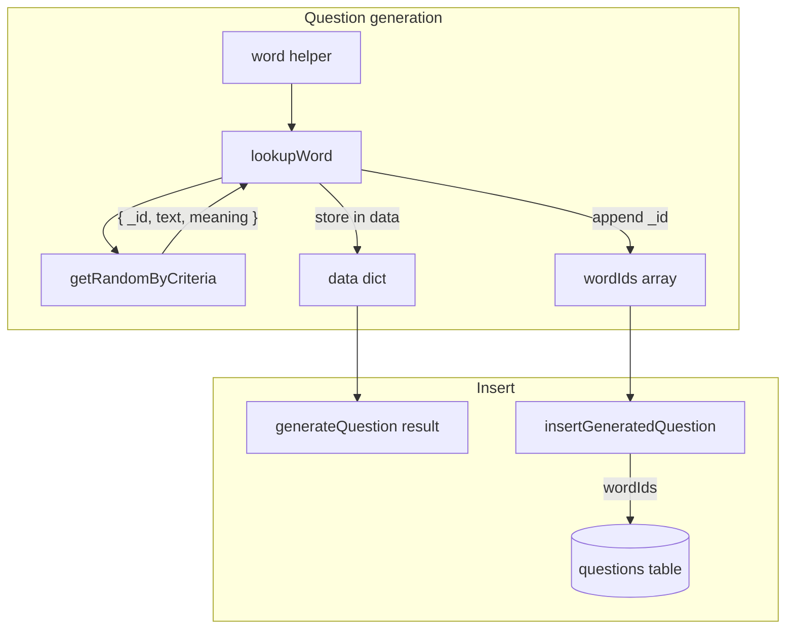

# Stage 2a – Store Words Used in Questions

## Summary

Add a `wordIds` field to the questions table (array of word IDs) and populate it during question generation with every word returned by the `word` helper.

## Current State

- [convex/schema.ts](convex/schema.ts): `questions` has `wordId: v.optional(v.id("words"))` (single, never populated by current code)
- [convex/words.ts](convex/words.ts): `getRandomByCriteria` and `getMatchingWordsByCriteria` return `{ text, meaning }` only
- [convex/questionGeneration.ts](convex/questionGeneration.ts): `LookupWordFn` returns `{ text, meaning } | null`; templates use `word.text` and `word.meaning`
- [convex/practiceInternal.ts](convex/practiceInternal.ts): `insertGeneratedQuestion` accepts `userId`, `language`, `questionTypeId`, `text`, `expected`; does not receive word IDs

## Requirements

- Add a field to Question that can store a set of word IDs (array or comma-separated string)
- For each word used in a Question, store its id in the Question's words field

**Decision:** Use `v.array(v.id("words"))` — Convex supports arrays; avoids parsing a string and preserves type safety.

## Implementation Plan

### 1. Schema change

**File:** [convex/schema.ts](convex/schema.ts)

- Replace `wordId` with `wordIds: v.optional(v.array(v.id("words")))`
- No migration needed: current code never sets `wordId`; existing questions will have `wordIds: undefined`

### 2. Words module – return `_id`

**File:** [convex/words.ts](convex/words.ts)

- Update `wordResultValidator` to include `_id: v.id("words")`
- `getMatchingWordsByCriteria`: change `return matches.map((w) => ({ text: w.text, meaning: w.meaning }))` to include `_id: w._id`
- `getRandomByCriteria`: return type already matches; chosen word includes `_id`

### 3. questionGeneration – extend LookupWordFn

**File:** [convex/questionGeneration.ts](convex/questionGeneration.ts)

- Change `LookupWordFn` return type to `Promise<{ _id: string; text: string; meaning: string } | null>`
- Templates continue to use `word.text` and `word.meaning`; `_id` is carried along but not required by templates

### 4. practiceActions – collect word IDs and pass to insert

**File:** [convex/practiceActions.ts](convex/practiceActions.ts)

- Create `wordIds: Id<"words">[] = []`
- Wrap `lookupWord` so it appends `result._id` to `wordIds` when result is non-null, then returns the result
- Update `insertGeneratedQuestion` call to include `wordIds` (deduplicated via `[...new Set(wordIds)]` if needed; typically each helper call is unique)
- Update the `lookupWord` cast to include `_id` in the return type

### 5. practiceInternal – insert `wordIds`

**File:** [convex/practiceInternal.ts](convex/practiceInternal.ts)

- Add `wordIds: v.optional(v.array(v.id("words")))` to `insertGeneratedQuestion` args
- Include `wordIds: args.wordIds` in the `ctx.db.insert("questions", {...})` call

### 6. Tests

- **questionGeneration.test.ts**: Update mocks to return `{ _id: "fakeId", text, meaning }`; adjust expectations if necessary
- **words.test.ts**: Assert `getRandomByCriteria` and `getMatchingWordsByCriteria` return `_id`
- **practice.test.ts**: Extend "generates question with word helper using type filter" to assert the inserted question has `wordIds` containing the word's ID

### 7. Documentation

- [docs/DATA_MODEL.md](docs/DATA_MODEL.md): Replace `wordId` with `wordIds: optional; array of word IDs used in the question`
- [docs/features/Practice Questions.md](docs/features/Practice Questions.md): Add Stage 2a implementation note

## Data flow

## Edge cases

- **No words used** (e.g. empty dataTemplate or no `word` helper): `wordIds` = `[]` or omit the field (both acceptable; use `[]` for consistency)
- **Same word used twice** (e.g. two `word` calls that both return the same word): Store unique IDs via `[...new Set(wordIds)]`
- **lookupWord returns null**: Do not add to `wordIds`; template receives null and may render empty
