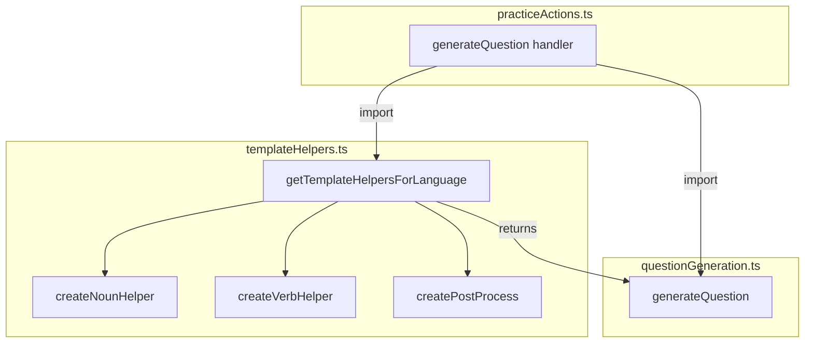

# Template Helpers Refactor

## Summary

Extract the template helper creation logic (lines 16-122 and 168-177 of `practiceActions.ts`) into a new file `convex/templateHelpers.ts`, add a focused unit test file, and simplify `practiceActions.ts` by removing Handlebars and NlgLib imports.

## New Module: `convex/templateHelpers.ts`

Create a new file with:

- **"use node"** directive (required for `rosaenlg-lib` / `NlgLib`)
- **Imports**: `Handlebars` (type only), `NlgLib` from `rosaenlg-lib`
- **Move from practiceActions.ts**:
  - `toNlgLocale` (language code → RosaeNLG locale)
  - `nlgCache` and `getNlgLib`
  - `wordTypeToGender`
  - `WordObj` type
  - `createNounHelper`, `createVerbHelper`, `createPostProcess`
- **New public API**:

```ts
export function getTemplateHelpersForLanguage(language: string): {
  templateHelpers: Record<string, Handlebars.HelperDelegate> | undefined;
  postProcess: ((text: string) => string) | undefined;
}
```

This encapsulates the `locale === "fr_FR"` branching: returns helpers and postProcess for French, `undefined` for other languages.

## Changes to [convex/practiceActions.ts](convex/practiceActions.ts)

1. **Remove imports** (lines 6-7): `type Handlebars` and `NlgLib`
2. **Add import**: `import { getTemplateHelpersForLanguage } from "./templateHelpers"`
3. **Replace** lines 168-177 with:

```ts
const { templateHelpers, postProcess } = getTemplateHelpersForLanguage(args.language);
```

1. **Delete** functions and helpers that moved: `toNlgLocale`, `nlgCache`, `getNlgLib`, `wordTypeToGender`, `WordObj`, `createNounHelper`, `createVerbHelper`, `createPostProcess` (lines 16-122)

## New Unit Test: `convex/templateHelpers.test.ts`

- **Environment**: `// @vitest-environment node` (NlgLib needs Node.js; `convex/*.test.ts` default is edge-runtime)
- **Strategy**: Call `generateQuestion` from `questionGeneration` with `getTemplateHelpersForLanguage("fr")` output, mock `lookupWord`, and the same templates as the integration tests. No Convex/DB required.

**Test 1 – noun helper (definite article)**  
Mirrors [practice.test.ts:377-407](convex/practice.test.ts):

- `dataTemplate`: `'noun = word text="chat"'`
- `questionTemplate`: `'{{noun word=noun art="def"}}'`
- `answerTemplate`: `"le chat"`
- `lookupWord`: returns `{ text: "chat", type: "nm", meaning: "cat" }` when `text === "chat"`
- Assert: `result.text.toLowerCase() === "le chat"` and `result.expected.toLowerCase() === "le chat"`

**Test 2 – verb helper (conjugated)**  
Mirrors [practice.test.ts:409-447](convex/practice.test.ts):

- `dataTemplate`: `'noun = word text="chat"\nverb = word text="manger"'`
- `questionTemplate`: `'Le chat ___. Réponse: {{verb word=verb subject=noun tense="PRESENT"}}'`
- `answerTemplate`: `'{{verb word=verb subject=noun tense="PRESENT"}}'`
- `lookupWord`: returns chat when `text === "chat"`, manger when `text === "manger"`
- Assert: `result.text` contains `"mange"`, `result.expected.toLowerCase() === "mange"`

**Optional**: Test `getTemplateHelpersForLanguage("en")` returns `undefined` for both helpers and postProcess to confirm non-French behavior.

## File Flow After Refactor




## Verification

- `npm run typecheck` and `npm run lint` pass
- `npm run test:once` passes (including new `templateHelpers.test.ts` and existing `practice.test.ts` French tests)
- Update [docs/ARCHITECTURE.md](docs/ARCHITECTURE.md) if it references where template helpers live (e.g., "in practiceActions" → "in templateHelpers module")

