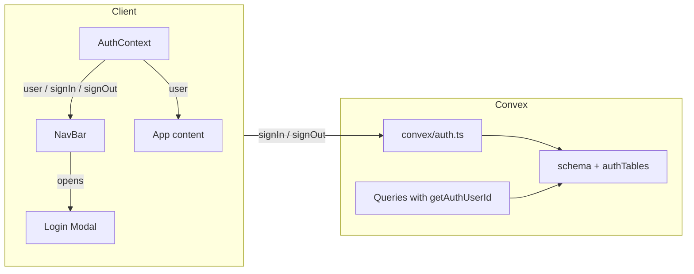

# User Login Feature Implementation

## Summary

Implement authentication using [Convex Auth](https://docs.convex.dev/auth/convex-auth) (beta): email + password only, no password reset. A nav-bar button (right of the language select) opens a modal for sign-in/sign-up. Current user is exposed via React context; Convex schema and future functions will scope data by `userId`.

## Current state

- **Convex**: Package present; no `convex/schema.ts`, no custom functions, no Convex provider in the app ([main.tsx](src/main.tsx) has no Convex wiring).
- **Nav**: [AppLayout.tsx](src/app/AppLayout.tsx) has nav links + language `Select` on the right; login control will sit to the right of the Select.
- **Data model**: [docs/DATA_MODEL.md](docs/DATA_MODEL.md) already specifies `userId` on `words` and `questionTypes`; `attempts` are tied via `wordId`/`questionTypeId` (ownership through those).

## Architecture (high level)

---

## 1. Convex Auth setup (backend)

**Dependencies**

- Install: `@convex-dev/auth` and `@auth/core@0.37.0` (per [Convex Auth setup](https://labs.convex.dev/auth/setup)).

**Initialization**

- Run `npx @convex-dev/auth` to generate config and auth files, or follow [manual setup](https://labs.convex.dev/auth/setup/manual):
  - `convex/auth.config.ts` (provider domain / applicationID).
  - `convex/auth.ts`: configure `convexAuth` with **Password** provider only (no `reset`, no `verify`), e.g. `providers: [Password]`.
  - `convex/http.ts`: create HTTP router and add `auth.addHttpRoutes(http)` so Auth routes are exposed.
- Set Convex env vars (per manual setup): `JWT_PRIVATE_KEY`, `JWKS` (and optionally `SITE_URL`; not required for password-only).
- If the init doesn’t touch `convex/tsconfig.json`, ensure `moduleResolution: "Bundler"` and `skipLibCheck: true` where needed.

**Schema**

- Add [convex/schema.ts](convex/schema.ts):
  - Spread `authTables` from `@convex-dev/auth/server` (provides `users`, `authSessions`).
  - Add app tables with `userId: v.id("users")` where specified in DATA_MODEL:
    - **words**: `userId`, `language`, `text`, `pos`, `gender`, `meaning`, `tags` (and indexes e.g. by `userId` + `language`).
    - **questionTypes**: `userId`, `language`, `name`, plus prompt/enabled fields as in DATA_MODEL.
    - **attempts**: `wordId`, `questionTypeId`, `questionText`, `answerGiven`, `isCorrect`/`score`, `respondedAt`, `durationMs`; consider `userId` for easier filtering (or rely on ownership via word/questionType).
- Run codegen (`npx convex dev`) so `_generated` types include the new tables.

**Auth helpers and a “current user” query**

- In Convex, use `getAuthUserId` from `@convex-dev/auth/server` inside queries/mutations to get the current user id (or null).
- Add a small **query** (e.g. `convex/users.ts`: `currentUser`) that returns the current user document (or null) using `getAuthUserId` + `ctx.db.get(userId)`. This will be used by the client context.

---

## 2. Client provider and auth context

**Convex provider**

- In [src/main.tsx](src/main.tsx): create `ConvexReactClient` with `VITE_CONVEX_URL`, wrap the app with `ConvexAuthProvider` from `@convex-dev/auth/react` (replacing or wrapping the existing tree so Convex + Auth are available). Keep `CurrentLanguageProvider` in the tree as needed so layout and routes still have language.

**Auth context**

- New **React context** (e.g. `src/contexts/AuthContext.tsx`) that:
  - Uses Convex `useQuery` to call the backend `currentUser` query.
  - Exposes: `user` (document or null), `isLoading` (from query), `signIn`, `signOut` (from `useAuthActions()` from `@convex-dev/auth/react`).
  - Wraps the part of the app that needs auth (e.g. inside `ConvexAuthProvider`, around the router or layout so nav and all pages can use it).

---

## 3. Nav bar login control and modal

**Placement**

- In [src/app/AppLayout.tsx](src/app/AppLayout.tsx), to the **right of** the current language `Select`, add the login control:
  - When **unauthenticated**: a button (e.g. “Log in”) that opens the login modal.
  - When **authenticated**: show a short label (e.g. email or name) and a “Log out” button (calling context `signOut`).

**Login modal**

- New component (e.g. `src/features/auth/LoginModal.tsx` or under `src/components/`) that:
  - Renders a modal (using Kumo modal/dialog if available, or a simple focused div with overlay).
  - Contains the **sign-in / sign-up form**: email, password, hidden `flow` field (`"signIn"` or `"signUp"`), submit calls `signIn("password", formData)` from context.
  - Toggle between “Sign in” and “Sign up” (flip `flow` and button labels).
  - On successful sign-in, close the modal (and optionally show a brief success state).
  - Accessible: focus trap, labels, dismiss via button and Escape.

**State for modal**

- Modal open/closed state can live in `AppLayout` (or a small wrapper): e.g. “Log in” sets open to true; modal closes on success or cancel.

---

## 4. Backend access pattern (for future and existing functions)

- **Pattern**: In any query/mutation that reads or writes user-scoped data, call `getAuthUserId(ctx)`; if null, throw (e.g. “Not authenticated”) or return empty as appropriate. Use the returned `userId` to filter (e.g. `.withIndex("by_userId_language", ...)`) or to set `userId` on insert.
- No new feature-specific Convex functions are required for “login” itself; the existing Convex Auth `signIn`/`signOut` and the new `currentUser` query are enough. When you add words/questionTypes/attempts CRUD or practice logic, apply this pattern and add indexes that include `userId` (and `language` where relevant).

---

## 5. Documentation and polish

- **docs/ARCHITECTURE.md**: Add a short “Authentication” section: Convex Auth, email+password only, session shared across tabs, current user via React context, and that data is scoped by `userId`.
- **docs/DATA_MODEL.md**: Already has `userId`; note that `users` (and sessions) come from Convex Auth `authTables`.
- **docs/features/User Login.md**: Optionally add a “Implemented” or “Technical notes” line pointing to ARCHITECTURE and the auth context.

---

## 6. Definition of done (recap)

- `npm run typecheck` and `npm run lint` pass.
- Login button right of language select; modal for sign-in/sign-up; sign out and user label when logged in.
- Current user available app-wide via React context (no direct Convex auth hooks in every screen).
- Schema includes `authTables` + words, questionTypes, attempts with `userId` where specified; one `currentUser` query; backend pattern documented for future functions.
- UI remains accessible (labels, focus, keyboard).
- Unauthenticated users can open the app and see the shell; they see “Log in” and get no user data until they sign in (queries return null/empty or require auth as chosen).

---

## Key files to add or touch

| Area   | Files                                                                                                                                                                                                                     |
| ------ | ------------------------------------------------------------------------------------------------------------------------------------------------------------------------------------------------------------------------- |
| Convex | `convex/auth.config.ts`, `convex/auth.ts`, `convex/http.ts`, `convex/schema.ts`, `convex/users.ts` (or similar for `currentUser` query)                                                                                   |
| Client | `src/main.tsx` (ConvexAuthProvider), `src/contexts/AuthContext.tsx`, `src/features/auth/LoginModal.tsx` (or `src/components/LoginModal.tsx`), [src/app/AppLayout.tsx](src/app/AppLayout.tsx) (login button + modal state) |
| Docs   | [docs/ARCHITECTURE.md](docs/ARCHITECTURE.md), [docs/DATA_MODEL.md](docs/DATA_MODEL.md)                                                                                                                                    |

---

## Out of scope (per feature doc)

- Password reset emails.
- OAuth or other providers (only email + password initially).

