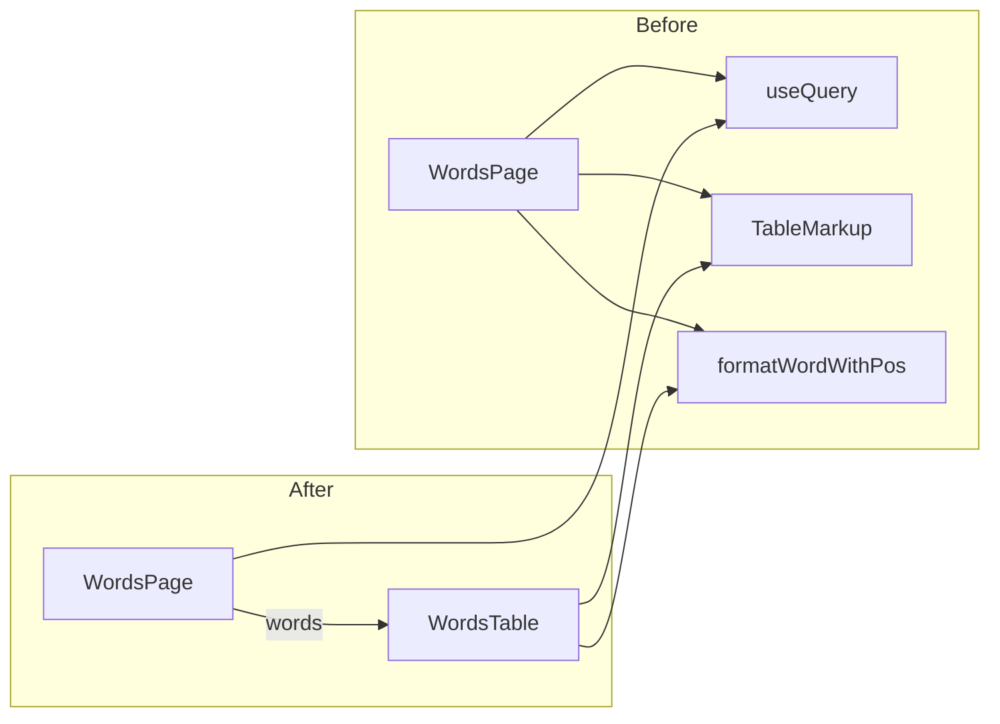

# Words table component and unit test

## 1. Extract `WordsTable` component

**New file: [src/features/words/WordsTable.tsx](src/features/words/WordsTable.tsx)**

- **Props:** `{ words: Doc<"words">[] }` (use `Doc` and `Id` from `convex/_generated/dataModel`).
- **Move into this file:** The table-specific pieces currently in [WordsPage.tsx](src/routes/WordsPage.tsx):
  - Constants: `POS_BG`, `GENDER_BG`, `POS_LETTER`, `GENDER_LETTER` (lines 10–29).
  - Helper: `formatWordWithPos` (lines 31–56).
  - The presentational table: the wrapping `
` and the full `<Table>` (header + body with rows for Text, Meaning, Tags).
- **Render:** Same structure as today: one row per word; first cell uses `formatWordWithPos(word)`, second cell `word.meaning`, third cell `word.tags ?? "—"`. No loading or empty state (those stay on the page).

**Update [src/routes/WordsPage.tsx](src/routes/WordsPage.tsx)**

- Remove the moved constants and `formatWordWithPos`.
- Remove the `Table` and `Empty` imports if they are no longer used on the page (keep `Empty` for the empty state).
- When `words.length > 0`, render `<WordsTable words={words} />` instead of the inline table.
- Keep all loading/empty logic and the section heading/description in the page.

## 2. Unit test for `WordsTable`

**New file: [src/features/words/WordsTable.test.tsx](src/features/words/WordsTable.test.tsx)**

- **Environment:** `@vitest-environment jsdom` (same as [AppLayout.test.tsx](src/app/AppLayout.test.tsx)).
- **Setup:** Use `customRender` and `screen` from [src/test-utils.tsx](src/test-utils.tsx) so the component is wrapped with `LinkProvider` and other app providers (required for Kumo `Table`).
- **Fixtures:** Build 2–3 `Doc<"words">`-shaped objects (with `_id`, `_creationTime`, `userId`, `language`, `text`, `pos`, `meaning`, and optionally `gender`, `tags`) using `as Id<"words">` and `as Doc<"words">` where needed so types match the schema in [convex/schema.ts](convex/schema.ts). Cover:
  - At least one word with `tags` and one without (to assert "—").
  - At least one with `gender` (e.g. noun with `gender: "M"`) so the cell content and/or sr-only text can be asserted.
- **Assertions:**
  - Table is in the document; column headers "Text", "Meaning", "Tags" are present.
  - For each fixture word, a row exists where:
    - The **Text** cell contains the word’s `text` (and the POS/gender badges or sr-only text if you want to lock in accessibility behavior).
    - The **Meaning** cell contains `word.meaning`.
    - The **Tags** cell contains `word.tags` or "—" when `tags` is missing.
- No Convex or router in the test; only render `<WordsTable words={[...]} />` with the fixture array.

## 3. Optional: shared types/fixtures

If you prefer to reuse word fixtures elsewhere, you can add a small `wordsFixture` or `mockWords` helper in the test file (or in `src/test-utils.tsx` / `src/features/words/test-fixtures.ts`). For this plan, keeping fixtures inside the test file is enough.

## 4. Verification

- Run `npm run typecheck` and `npm run lint`.
- Run `npm run test:once` (or `vitest run src/features/words/WordsTable.test.tsx`) and confirm the new test passes.

## Summary diagram

After the refactor, `WordsPage` stays the single place that fetches `words` and handles loading/empty; `WordsTable` is a presentational component that only receives `words` and renders the table, making it straightforward to unit test with fixed data.
